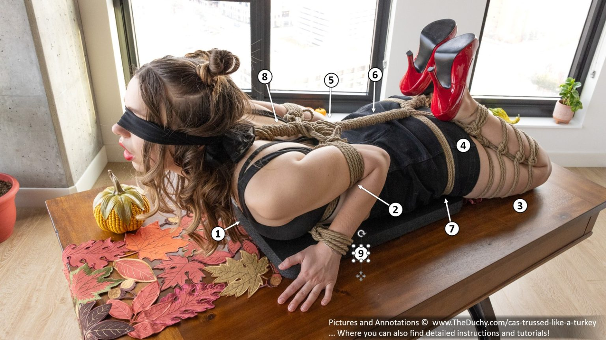

# Shibari

<!-- vim-markdown-toc GFM -->

* [Core](#core)
* [TK](#tk)
* [Misc](#misc)
* [BTS](#bts)
* [Art](#art)

<!-- vim-markdown-toc -->

## Core

- [Junctions](/shibari.junctions) 
- [Somerville](/shibari.somerville.bowline) 

## TK

- [2TK](/shibari.tk.2/) 
- [3TK](/shibari.tk.3.x/) 
- [3TK-Y](/shibari.tk.3.y/) 
- [Fuji](/shibari.tk.3.fuji/) 

## Misc

- [Malasana](/shibari.malasana.tie/) 
- [Doggy Style Harness](/shibari.doggy.style.harness) 
- [Mounting Harness](/shibari.mounting.harness) 
- [Solomon G String](/shibari.solomon.g.string/) 

## BTS

### BTS Malasana
1. Add a [Malasana Tie](https://www.theduchy.com/malasana/) to hold your partner in a bent, legs-open position.
2. Add a [Lark’s Head Double Column](https://www.theduchy.com/larks-head-double-column/) to the wrists.
3. Add a rope around the cinch of 3 to make it [load-baring](https://www.theduchy.com/load-bearing-double-column/).
4. Add a [Slipped Somerville Bowline](https://www.theduchy.com/somerville-bowline/#slipped-somerville-bowline) to each ankle.
5. Have your partner get in position.
6. Tie the leads to anchor points using whatever technique you like. The simplest method is using [Two Half Hitches](https://www.theduchy.com/half-hitches/).
7. (Not Shown) If you want to prevent your partner from being able to wiggle up toward the headboard, you could use a [Lark’s Head Knot](https://www.theduchy.com/larks-head-knot/) to add a new rope to the center back of the Malasana before you have your partner lay down (before Step 5 above).  Then tie it off to the foot of the bed here at Step 7.

### BTS Malasana
1. Add a [Malasana Tie](https://www.theduchy.com/malasana/) to hold your partner in a bent, legs-open position.
2. Add a [Lark’s Head Double Column](https://www.theduchy.com/larks-head-double-column/) to the wrists.
3. Add a rope around the cinch of 3 to make it [load-baring](https://www.theduchy.com/load-bearing-double-column/).
4. Add a [Slipped Somerville Bowline](https://www.theduchy.com/somerville-bowline/#slipped-somerville-bowline) to each ankle.
5. Have your partner get in position.
6. Tie the leads to anchor points using whatever technique you like. The simplest method is using [Two Half Hitches](https://www.theduchy.com/half-hitches/).

### BTS Turkey
1. Start with a [Shinju](https://www.theduchy.com/shinju/) with an optional extra wrap on the top strap to better distribute the force.
2. Add a [Slipped Somerville Bowline](https://www.theduchy.com/somerville-bowline/#slipped-somerville-bowline) around each bicep. Let the tails drop for now.
3. Add a [Spiral Futomomo](https://www.theduchy.com/spiral-futomomo/) to each leg. (Alternatively, you can use a [Double Column](https://www.theduchy.com/larks-head-double-column/).)
4. Add a new rope to each ankle cuff, with the tail leading toward the torso. You can use a simple [Lark’s Head Knot](https://www.theduchy.com/larks-head-knot/) to do so, or use a Woven Lark’s Head as shown in Details below.
5. Bring the tails from (4) up to and under the upper chest strap. (Optional) Pull them to pull your partner into an arch.
6. Wrap the tails around the stem to use them up.
7. If you have a lot of rope left over like I did, you can also use it up by running the strands around the body.
8. Use the tails from (2) to pull the arms toward the back. Run the tails under the stem to hold the arm cuffs in place, then use up the extra rope by wrapping it around the upper stem.
9. (Optional) Add [Single Column](https://www.theduchy.com/larks-head-single-column/)s to each wrist, then connect them together in front of the chest so that the arms cannot be straightened.

## Art

- 
- 
- 
- 
- 

<!--
<table>
<tr><th>Art</th></tr>
<tr>
 <td>4 Advices for Drawing <a href="./assets/misc/4.advices.for.drawing.shibari.jpg"></td>
 <td></td>
 <td></td>
</tr>
<tr><th>Portland Shibari</th></tr>
<tr>
 <td>Kinoko TK <a href="./portland.shibari.md#20230719-kinoko-style-tk"></td>
 <td></td>
 <td></td>
</tr>
<tr><th>Core</th></tr><tr>
 <td>Square Knot </td>
 <td>Lark's Head </td>
</tr><tr>
 <td>Hojo Cuff </td>
 <td>Leash </td>
 <td>Cored Square Knot </td>
</tr><tr><th>Chest Harness</th></tr><tr>
 <td>Hobble Elbow Tie </td>
 <td>Bikini Harness </td>
 <td>Barre Harness </td>
</tr><tr>
 <td>Munenawa Harness </td>
 <td>RWR Breast Cage </td>
</tr><tr><th>Hip Harness</th></tr><tr>
 <td>Doggy Style </td>
 <td>Malasana </td>
</tr><tr><th>Suspension</th></tr><tr>
 <td>Suspension Shinju </td>
 <td>Swiss Seat </td>
 <td>Suspension Futomomo </td>
</tr><tr>
 <td>Gravity Boot </td>
</tr><tr>
 <td>Building Blocks: Junctions </td>
 <td>Suspension Hangers </td>
 <td>Friction for Hard Points </td>
</tr><tr><th>Pretty</th></tr><tr>
 <td>Tengu </td>
 <td>Vine Futomomo </td>
 <td>Solomon G-String </td>
</tr><tr>
 <td>Chain Stitch Corset </td>
 <td>Suspenders </td>
 <td>Harley Quinn </td>
</tr><tr>
 <td>Loop Chain Harness </td>
 <td>Fisherman's Hobbleskirt </td>
</tr><tr><th><a href="https://www.theduchy.com/bts/#bts-tutorials" >Behind the Scene - TheDuchy</a></th></tr><tr>
 <td>Bed Bondage </td>
 <td></td>
</tr><tr>
 <td></td>
 <td></td>
 <td></td>
</tr>
</table>
-->

